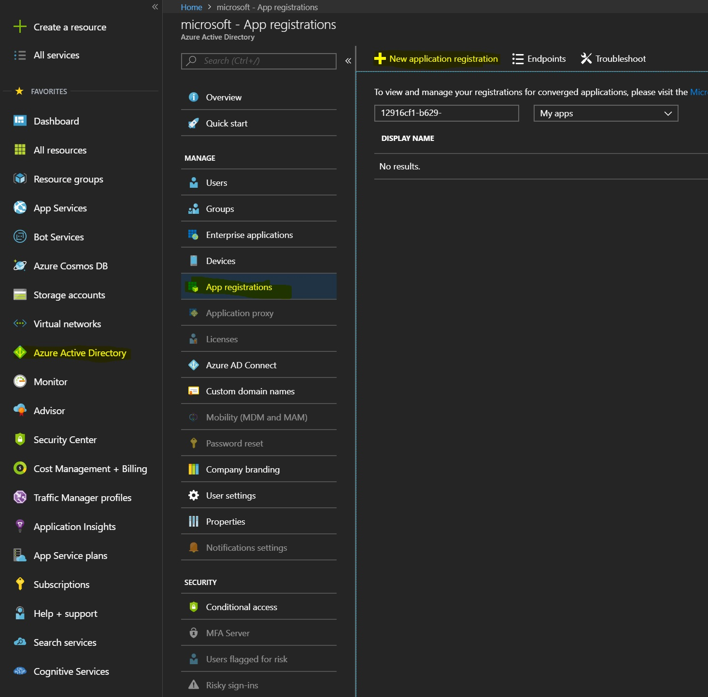
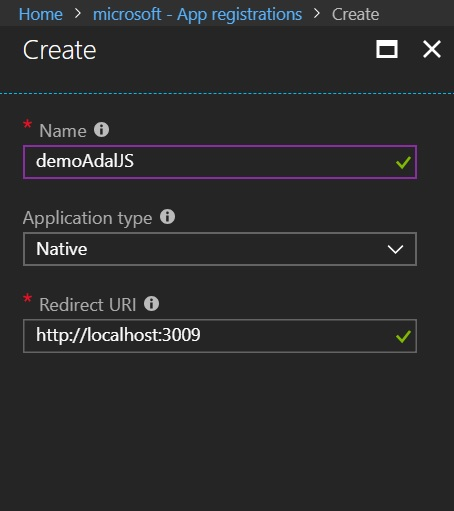
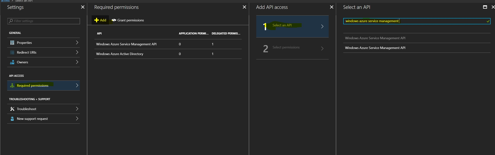
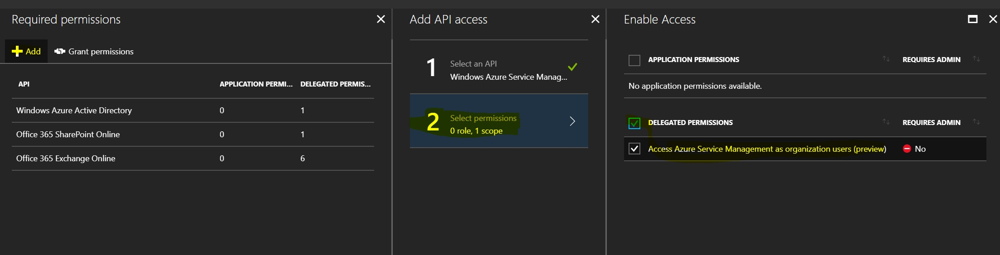
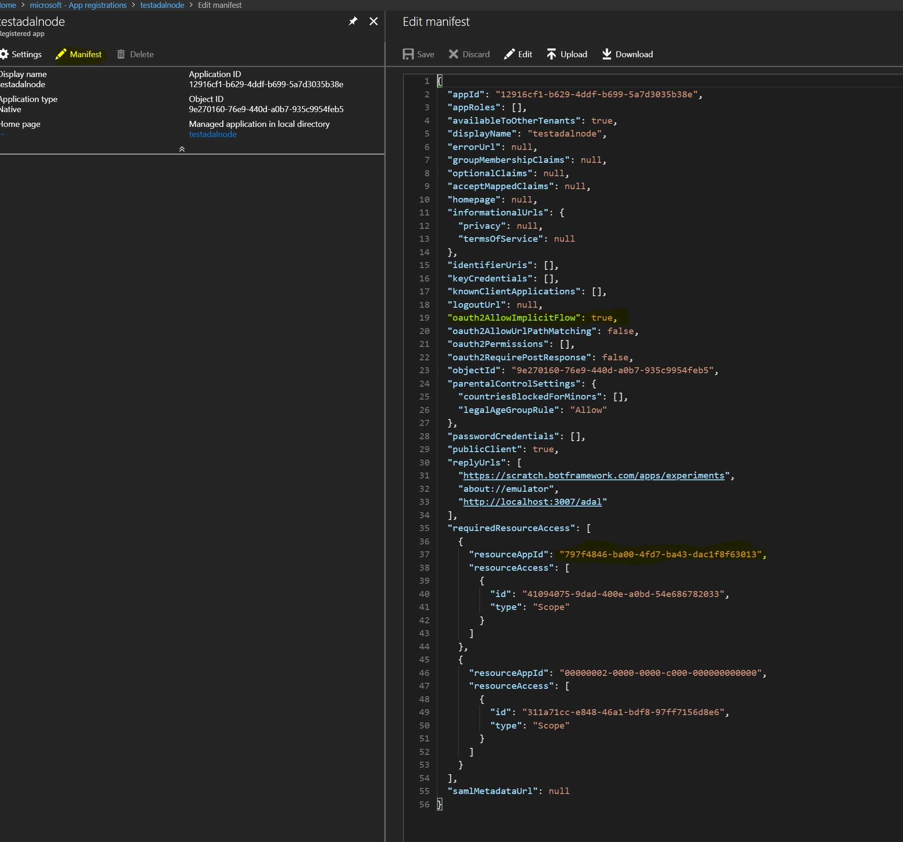

# ADAL for getting ARM token

## Get Started

```bash
npm install @fuselab/ui-adal
```

or

```bash
lerna add @fuselab/ui-adal
```

## Provision app in Azure active directory

1. Login to https://portal.azure.com
1. Go to "Azure Active Directory", select "app registrations", click on "New application registration"

   

1. Create a new native app registration

   

   for RedirectUri fill in your dev-server localhost address (you will add redirect uris for your other environment later)

1. Add additional RedirectUri for different environments

   

1. Request access to ARM API

   

   and set scope to delegated

   

1. Verify/update app manifest

   

   * make sure that <kbd>oauth2AllowImplicitFlow</kbd> is set to <kbd>true</kbd>
   * make sure that resourceId <kbd>797f4846-ba00-4fd7-ba43-dac1f8f63013</kbd> (for ARM) is present
